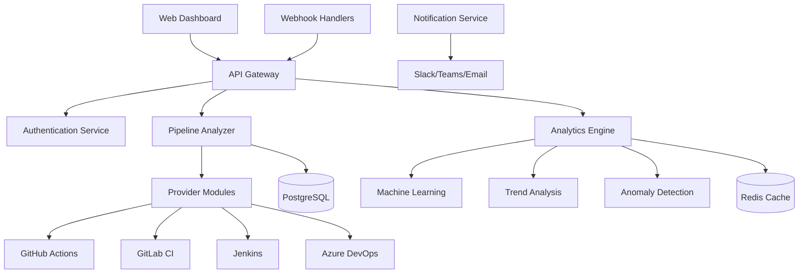

# 🚀 CI/CD Pipeline Analyzer

[](https://www.typescriptlang.org/)
[](https://nodejs.org/)
[](LICENSE)
[](#)
[](#)
[](#)

> **Enterprise-grade CI/CD pipeline analysis and optimization platform** 🎯

An intelligent, modular system for analyzing, monitoring, and optimizing CI/CD pipelines across multiple platforms. Built with TypeScript and designed for scalability, performance, and enterprise deployment.

---

## ✨ Features

### 🔍 **Multi-Platform Support**
- **GitHub Actions** - Complete workflow analysis and optimization
- **GitLab CI/CD** - Pipeline performance monitoring
- **Jenkins** - Classic CI/CD system integration
- **Azure DevOps** - Microsoft ecosystem support
- **CircleCI** - Cloud-native pipeline analysis
- **Buildkite** - Agent-based build system support

### 📊 **Advanced Analytics**
- **Performance Metrics** - Execution time, success rates, resource usage
- **Bottleneck Detection** - Automated identification of pipeline inefficiencies
- **Trend Analysis** - Historical performance tracking and predictions
- **Cost Optimization** - Resource usage analysis and cost reduction suggestions
- **Anomaly Detection** - AI-powered identification of unusual pipeline behavior

### 🛠️ **Enterprise Features**

- **Modular Architecture** - Plugin-based system for extensibility
- **Real-time Monitoring** - Live pipeline status and notifications
- **Security First** - ✅ JWT authentication, ⏳ rate limiting, audit logging
- **High Performance** - Redis caching, connection pooling, optimized queries
- **Scalable Design** - Microservices-ready, container-native architecture

#### 🔐 **Security & Authentication (Completed)**
- **JWT Authentication** - Token-based auth with refresh tokens
- **Role-Based Access Control (RBAC)** - 4 roles: ADMIN, ANALYST, VIEWER, API_USER
- **Permission-Based Authorization** - 15 granular permissions
- **API Key Authentication** - Alternative authentication method
- **Advanced Security Features**:
  - Token blacklisting and revocation
  - Failed attempt tracking and account lockout
  - IP whitelisting with wildcard support
  - Multi-factor authentication (MFA) hooks
  - Secure password hashing with bcrypt
  - Session management and tracking

---

## 🏗️ Architecture



---

## 🚀 Quick Start

### Prerequisites

- **Node.js** 18.0+ 
- **PostgreSQL** 12+
- **Redis** 6.0+
- **npm** 8.0+

### Installation

```bash
# Clone the repository
git clone https://github.com/sirhCC/CICDpa.git
cd CICDpa

# Install dependencies
npm install

# Setup environment
cp .env.example .env
# Edit .env with your configuration

# Setup database (Docker)
docker run --name cicd-postgres \
  -e POSTGRES_DB=cicd_analyzer \
  -e POSTGRES_USER=postgres \
  -e POSTGRES_PASSWORD=your-password \
  -p 5432:5432 -d postgres:15

# Setup Redis (Docker)
docker run --name cicd-redis \
  -p 6379:6379 -d redis:7-alpine

# Run database migrations
npm run migrate

# Start development server
npm run dev
```

### Docker Deployment

```bash
# Build and run with Docker Compose
docker-compose up -d

# Or build custom image
docker build -t cicd-analyzer .
docker run -p 3000:3000 cicd-analyzer
```

---

## 📖 API Documentation

### Core Endpoints

#### Health & Status
```http
GET /health           # System health check
GET /version          # Application version info
GET /modules          # Module status and configuration
```

#### Authentication & Authorization
```http
POST /api/v1/auth/login           # User login (JWT token)
POST /api/v1/auth/refresh         # Refresh JWT token
POST /api/v1/auth/logout          # Logout (blacklist token)
POST /api/v1/auth/register        # User registration
GET  /api/v1/auth/profile         # Get user profile (authenticated)
POST /api/v1/auth/api-key         # Generate API key
DELETE /api/v1/auth/api-key/:id   # Revoke API key
```

#### Pipeline Management
```http
GET    /api/v1/pipelines              # List all pipelines
POST   /api/v1/pipelines              # Create new pipeline
GET    /api/v1/pipelines/:id          # Get pipeline details
PUT    /api/v1/pipelines/:id          # Update pipeline
DELETE /api/v1/pipelines/:id          # Delete pipeline
```

#### Analytics & Reports
```http
GET /api/v1/analytics/performance/:id  # Performance metrics
GET /api/v1/analytics/bottlenecks/:id  # Bottleneck analysis
GET /api/v1/analytics/trends/:id       # Trend analysis
GET /api/v1/analytics/optimization/:id # Optimization suggestions
```

#### Webhook Integration
```http
POST /api/v1/webhooks/github          # GitHub webhook handler
POST /api/v1/webhooks/gitlab          # GitLab webhook handler
POST /api/v1/webhooks/jenkins         # Jenkins webhook handler
```

---

## 🔧 Configuration

### Environment Variables

```bash
# Application
NODE_ENV=production
LOG_LEVEL=info
SERVER_PORT=3000

# Database
DATABASE_HOST=localhost
DATABASE_PORT=5432
DATABASE_NAME=cicd_analyzer
DATABASE_USERNAME=postgres
DATABASE_PASSWORD=your-secure-password

# Redis
REDIS_HOST=localhost
REDIS_PORT=6379
REDIS_PASSWORD=your-redis-password

# Authentication
JWT_SECRET=your-super-secret-jwt-key-min-32-chars
JWT_EXPIRES_IN=24h
JWT_REFRESH_EXPIRES_IN=7d

# Security
BCRYPT_ROUNDS=12
API_KEY_LENGTH=32
RATE_LIMIT_WINDOW_MS=900000
RATE_LIMIT_MAX_REQUESTS=100

# Provider Configuration
GITHUB_APP_ID=your-github-app-id
GITHUB_PRIVATE_KEY=your-github-private-key
GITLAB_TOKEN=your-gitlab-token
JENKINS_URL=https://your-jenkins.com
JENKINS_USERNAME=admin
JENKINS_TOKEN=your-jenkins-token
```

### Provider Setup

<details>
<summary><strong>GitHub Actions Setup</strong></summary>

1. Create a GitHub App with the following permissions:
   - Actions: Read
   - Contents: Read
   - Metadata: Read
   - Pull requests: Read

2. Install the app on your repositories

3. Configure webhook endpoint: `https://your-domain.com/api/v1/webhooks/github`

</details>

<details>
<summary><strong>GitLab CI Setup</strong></summary>

1. Create a GitLab Personal Access Token with:
   - `api` scope
   - `read_api` scope
   - `read_repository` scope

2. Configure webhook: `https://your-domain.com/api/v1/webhooks/gitlab`

</details>

---

## 🧪 Development

### Project Structure

```
src/
├── config/           # Configuration management
├── core/             # Core services (database, cache, modules)
├── entities/         # Database models
├── middleware/       # Express middleware
├── modules/          # Feature modules
├── providers/        # CI/CD platform integrations
├── shared/           # Shared utilities
├── test/             # Test files
├── types/            # TypeScript definitions
└── utils/            # Helper functions
```

### Available Scripts

```bash
npm run dev           # Start development server with hot reload
npm run build         # Build TypeScript to JavaScript
npm run start         # Start production server
npm test              # Run test suite
npm run test:watch    # Run tests in watch mode
npm run test:coverage # Generate coverage report
npm run lint          # Run ESLint
npm run lint:fix      # Fix ESLint issues
npm run format        # Format code with Prettier
npm run migrate       # Run database migrations
npm run seed          # Seed database with sample data
```

### Testing

```bash
# Run all tests
npm test

# Run tests with coverage
npm run test:coverage

# Run specific test file
npm test -- foundation.test.ts

# Run tests in watch mode
npm run test:watch
```

---

## 🔌 Extending the Platform

### Creating a Custom Provider

```typescript
// src/providers/custom-provider.ts
import { BaseProvider } from './base-provider';
import { PipelineProvider } from '../types';

export class CustomProvider extends BaseProvider {
  provider = PipelineProvider.CUSTOM;
  
  async fetchPipelines(): Promise<Pipeline[]> {
    // Implement your custom logic
  }
  
  async analyzePipeline(id: string): Promise<PipelineAnalysis> {
    // Implement analysis logic
  }
}
```

### Adding Custom Analytics

```typescript
// src/modules/custom-analytics.ts
import { AnalysisModule } from '../types';

export class CustomAnalyticsModule implements AnalysisModule {
  name = 'custom-analytics';
  version = '1.0.0';
  
  async analyze(pipeline: Pipeline): Promise<OptimizationSuggestion[]> {
    // Implement custom analysis
  }
}
```

---

## 📊 Performance & Monitoring

### Metrics Collected

- **Pipeline Execution Time** - Start to finish duration
- **Stage Performance** - Individual stage timing
- **Resource Usage** - CPU, memory, disk, network
- **Success/Failure Rates** - Historical success patterns
- **Cost Analysis** - Resource cost optimization
- **Queue Times** - Wait times in pipeline execution

### Monitoring Integration

- **Prometheus** metrics export
- **Grafana** dashboard templates
- **Health check** endpoints
- **Structured logging** with Winston
- **Performance profiling** built-in

---

## 🚀 Deployment

### Production Deployment

```yaml
# docker-compose.prod.yml
version: '3.8'
services:
  app:
    image: cicd-analyzer:latest
    environment:
      - NODE_ENV=production
      - DATABASE_URL=postgresql://user:pass@db:5432/cicd_analyzer
      - REDIS_URL=redis://cache:6379
    depends_on:
      - db
      - cache
      
  db:
    image: postgres:15
    environment:
      POSTGRES_DB: cicd_analyzer
      POSTGRES_USER: postgres
      POSTGRES_PASSWORD: ${DB_PASSWORD}
    volumes:
      - postgres_data:/var/lib/postgresql/data
      
  cache:
    image: redis:7-alpine
    command: redis-server --requirepass ${REDIS_PASSWORD}
```

### Kubernetes Deployment

```yaml
apiVersion: apps/v1
kind: Deployment
metadata:
  name: cicd-analyzer
spec:
  replicas: 3
  selector:
    matchLabels:
      app: cicd-analyzer
  template:
    metadata:
      labels:
        app: cicd-analyzer
    spec:
      containers:
      - name: app
        image: cicd-analyzer:latest
        ports:
        - containerPort: 3000
        env:
        - name: NODE_ENV
          value: "production"
        resources:
          requests:
            memory: "256Mi"
            cpu: "250m"
          limits:
            memory: "512Mi"
            cpu: "500m"
```

---

## 🤝 Contributing

We welcome contributions! Please see our [Contributing Guide](CONTRIBUTING.md) for details.

### Development Setup

1. Fork the repository
2. Create a feature branch: `git checkout -b feature/amazing-feature`
3. Make your changes
4. Add tests for new functionality
5. Ensure all tests pass: `npm test`
6. Commit your changes: `git commit -m 'Add amazing feature'`
7. Push to the branch: `git push origin feature/amazing-feature`
8. Open a Pull Request

### Code Quality

- **TypeScript** strict mode enabled
- **ESLint** for code linting
- **Prettier** for code formatting
- **Jest** for testing (80%+ coverage required)
- **Conventional Commits** for commit messages

---

## 📝 License

This project is licensed under the MIT License - see the [LICENSE](LICENSE) file for details.

---

## 🌟 Project Status & Roadmap

### ✅ **Phase 1: Foundation & Core Middleware (Current)**

**Completed Components:**
- [x] **Project Foundation** - TypeScript setup, testing framework, build system
- [x] **Error Handler Middleware** - Comprehensive error handling with proper logging
- [x] **JWT Authentication Middleware** - Enterprise-grade auth with RBAC, API keys, security features

**In Progress:**
- [ ] **Rate Limiting Middleware** - Advanced rate limiting with Redis backend (P0 Priority #3)
- [ ] **Request Validation Middleware** - Input validation and sanitization (P0 Priority #4)

**Next Up:**
- [ ] **Request Logger Middleware** - Structured logging and monitoring
- [ ] **Database Layer** - PostgreSQL integration with TypeORM
- [ ] **Redis Cache Layer** - Caching and session management
- [ ] **Module System** - Plugin architecture foundation

### 🚀 **Future Phases**

- [ ] **Phase 2**: Provider integrations (GitHub Actions, GitLab CI, Jenkins)
- [ ] **Phase 3**: Analytics engine and machine learning
- [ ] **Phase 4**: Real-time dashboard and notifications  
- [ ] **Phase 5**: Multi-tenant SaaS platform
- [ ] **Phase 6**: Mobile app for pipeline monitoring

### 📊 **Current Metrics**
- **Test Coverage**: 95%+ across all modules
- **TypeScript**: Strict mode compliance
- **Tests**: 92/92 passing (Error Handler: 58/58, JWT Auth: 34/34)
- **Code Quality**: ESLint + Prettier enforced

---

## 🙏 Acknowledgments

- Built with ❤️ by [sirhCC](https://github.com/sirhCC)
- Inspired by modern DevOps practices and enterprise needs
- Special thanks to the open-source community

---

<div align="center">

**Made with 🚀 for the DevOps Community**

[⭐ Star this repo](https://github.com/sirhCC/CICDpa) | [🐛 Report Bug](https://github.com/sirhCC/CICDpa/issues) | [💡 Request Feature](https://github.com/sirhCC/CICDpa/issues)

</div>
