# 🚀 CI/CD Pipeline Analyzer

[](https://www.typescriptlang.org/)
[](https://nodejs.org/)
[](LICENSE)
[](#)
[](#)
[](#)

> **Enterprise-grade CI/CD pipeline analysis and optimization platform** 🎯

An intelligent, modular system for analyzing, monitoring, and optimizing CI/CD pipelines across multiple platforms. Built with TypeScript and designed for scalability, performance, and enterprise deployment.

## 🌟 **Current Status - Production Ready!**

### ✅ **All Phases Complete** - 272/272 Tests Passing

- **🏗️ Enterprise Foundation** - Complete middleware stack, security, database layer
- **📊 Analytics Engine** - Real-time metrics, pattern detection, optimization recommendations  
- **🔬 Statistical Analytics Engine** - Core mathematical analysis engine (anomaly detection, trend analysis, benchmarking, SLA monitoring, cost analysis)
- **🔐 Production Security** - SSL, authentication, auditing, threat detection
- **🚀 Ready for Deployment** - Docker, Kubernetes, comprehensive monitoring

---

## 🚀 **Quick Start**

### **Prerequisites**
- Node.js 18.0+, PostgreSQL 12+, Redis 6.0+

### **Installation & Setup**
```bash
# Clone and install
git clone https://github.com/sirhCC/CICDpa.git
cd CICDpa && npm install

# Setup environment
cp .env.example .env  # Edit with your configuration

# Quick setup with Docker
docker-compose up -d  # Includes PostgreSQL + Redis

# Run migrations and start
npm run migrate && npm run dev
```

### **🎯 What You Get Immediately**
- **Analytics Dashboard** at `http://localhost:3000/api/v1/analytics/dashboard`
- **Statistical Analytics** with mathematical analysis endpoints
- **Real-time Pipeline Analysis** with failure pattern detection
- **Production-ready Database** with SSL and security monitoring

---

## ✨ **Core Features**

### 📊 **Analytics Engine** ✅ *Production Ready*
```http
GET /api/v1/analytics/dashboard              # Complete analytics overview
GET /api/v1/analytics/pipelines/:id/metrics  # Pipeline performance metrics  
GET /api/v1/analytics/patterns               # AI failure pattern detection
GET /api/v1/analytics/alerts                 # Smart alerting system
```

**What It Does:**
- **Real-time Metrics** - Success rates, execution times, throughput analysis
- **Failure Detection** - AI-powered pattern recognition for recurring issues
- **Smart Alerts** - Performance degradation, failure spikes, resource waste
- **Optimization Suggestions** - Automated recommendations for improvement

### 🔬 **Statistical Analytics Engine** ✅ *Complete*
```http
POST /api/v1/analytics/statistical/anomalies   # Detect anomalies in time series data
POST /api/v1/analytics/statistical/trends      # Mathematical trend analysis with regression
POST /api/v1/analytics/statistical/benchmark   # Compare against historical performance  
POST /api/v1/analytics/statistical/sla         # Monitor SLA compliance and violations
POST /api/v1/analytics/statistical/costs       # Cost analysis with optimization recommendations
GET  /api/v1/analytics/statistical/health      # Statistical engine health check
```

**Advanced Statistical Features:**
- **Anomaly Detection** - Z-score and percentile-based outlier detection
- **Trend Analysis** - Linear regression with confidence intervals and correlation metrics
- **Benchmark Comparison** - Percentile ranking against historical performance data
- **SLA Monitoring** - Real-time compliance tracking with violation severity assessment
- **Cost Analysis** - Resource optimization with efficiency scoring and savings recommendations
- **Mathematical Models** - Statistical calculations including variance, correlation, and regression analysis

### 🔍 **Multi-Platform Support** 
- **GitHub Actions** ✅ Complete integration
- **GitLab CI/CD** ✅ Full pipeline analysis  
- **Jenkins** 🔄 Coming in Phase 4
- **Azure DevOps** 🔄 Planned
- **CircleCI** 🔄 Roadmap

### 🛡️ **Enterprise Security** ✅ *Production Ready*
```http
POST /api/v1/auth/login     # JWT authentication
GET  /api/v1/auth/profile   # User management
POST /api/v1/auth/api-key   # API key generation
```

**Security Features:**
- **JWT Authentication** with refresh tokens and role-based access
- **Rate Limiting** with multiple strategies (fixed window, sliding window, token bucket)
- **SSL/TLS Security** with certificate validation and connection auditing
- **Input Validation** with XSS protection and data sanitization
- **Audit Logging** for compliance (GDPR, SOC2)

### 🗄️ **Production Database** ✅ *Enterprise Grade*
- **PostgreSQL** with TypeORM and SSL encryption
- **Connection Pooling** with health monitoring and retry logic
- **Security Auditing** with suspicious query detection
- **Migration System** with rollback support
- **Performance Monitoring** with connection tracking

---

## 🏗️ **Architecture**

```mermaid
graph TB
    A[Analytics Dashboard] --> B[API Gateway v1]
    B --> C[Auth & Security Layer]
    B --> D[Analytics Engine]
    B --> E[Statistical Engine]
    B --> F[Provider Integrations]
    
    D --> G[Metrics Calculator]
    D --> H[Pattern Detector] 
    D --> I[Alert Manager]
    
    E --> J[Anomaly Detection]
    E --> K[Trend Analysis]
    E --> L[Benchmarking]
    E --> M[SLA Monitoring]
    
    F --> N[GitHub Actions ✅]
    F --> O[GitLab CI ✅]
    F --> P[Jenkins 🔄]
    
    C --> Q[(PostgreSQL)]
    D --> Q
    E --> Q
    C --> R[(Redis Cache)]
    D --> R
    
    S[Webhook Handlers] --> B
    T[Security Monitor] --> Q
```



**Key Components:**
- **API Gateway** - Versioned APIs with standardized responses
- **Analytics Engine** - Real-time processing with intelligent recommendations
- **Statistical Engine** - Mathematical analysis without AI/ML complexity
- **Security Layer** - Multi-layered protection with comprehensive auditing
- **Provider System** - Extensible integrations with type-safe factory pattern

---

## 📖 **API Reference**

### **Core Endpoints**
```http
# System Health
GET /health                 # Application health check
GET /api/version           # API version discovery

# Authentication  
POST /api/v1/auth/login    # User login (returns JWT)
POST /api/v1/auth/refresh  # Refresh token
GET  /api/v1/auth/profile  # User profile

# Pipeline Management
GET    /api/v1/pipelines         # List all pipelines  
POST   /api/v1/pipelines         # Create pipeline
GET    /api/v1/pipelines/:id     # Get pipeline details
PUT    /api/v1/pipelines/:id     # Update pipeline

# Analytics
GET /api/v1/analytics/dashboard                    # Analytics overview
GET /api/v1/analytics/pipelines/:id/metrics       # Pipeline metrics
GET /api/v1/analytics/patterns                    # Failure patterns  
GET /api/v1/analytics/pipelines/:id/recommendations # Optimization tips
GET /api/v1/analytics/alerts                      # Smart alerts
PUT /api/v1/analytics/alerts/:id                  # Update alert status

# Statistical Analytics
POST /api/v1/analytics/statistical/anomalies      # Anomaly detection in time series
POST /api/v1/analytics/statistical/trends         # Mathematical trend analysis  
POST /api/v1/analytics/statistical/benchmark      # Performance benchmarking
POST /api/v1/analytics/statistical/sla            # SLA compliance monitoring
POST /api/v1/analytics/statistical/costs          # Cost analysis & optimization
GET  /api/v1/analytics/statistical/health         # Statistical engine health
```

### **Response Format**
All APIs return consistent responses with version info:
```json
{
  "success": true,
  "data": { /* ... response data ... */ },
  "message": "Request processed successfully", 
  "meta": {
    "timestamp": "2025-01-15T10:30:00.000Z",
    "version": { "api": "v1", "app": "1.0.0" },
    "requestId": "req_abc123",
    "performance": { "executionTime": 45 }
  }
}
```

---

## 🔬 **Statistical Analytics Usage Examples**

### **Anomaly Detection**
```typescript
// POST request with sample time series data
const response = await fetch('/api/v1/analytics/statistical/anomalies', {
  method: 'POST',
  headers: { 'Content-Type': 'application/json', 'Authorization': 'Bearer your-token' },
  body: JSON.stringify({
    data: [
      { timestamp: "2024-01-01T10:00:00Z", value: 450 },
      { timestamp: "2024-01-01T11:00:00Z", value: 1800 }, // Anomaly
      { timestamp: "2024-01-01T12:00:00Z", value: 470 }
    ],
    method: "z-score"
  })
});

// Response: Detailed anomaly analysis
{
  "success": true,
  "data": {
    "anomalies": [
      {
        "timestamp": "2024-01-01T11:00:00Z",
        "value": 1800,
        "severity": "major",
        "zScore": 3.2,
        "percentile": 99.1
      }
    ],
    "summary": {
      "totalDataPoints": 3,
      "anomaliesDetected": 1,
      "anomalyRate": 33.33,
      "method": "z-score"
    }
  }
}
```

### **Trend Analysis**
```typescript
// Analyze performance trends
const trends = await fetch('/api/v1/analytics/statistical/trends', {
  method: 'POST',
  headers: { 'Content-Type': 'application/json', 'Authorization': 'Bearer your-token' },
  body: JSON.stringify({
    data: [
      { timestamp: "2024-01-01T00:00:00Z", value: 500 },
      { timestamp: "2024-01-02T00:00:00Z", value: 480 },
      { timestamp: "2024-01-03T00:00:00Z", value: 460 }
    ],
    method: "regression"
  })
});

// Response: Statistical trend analysis
{
  "success": true,
  "data": {
    "trend": "improving",
    "slope": -0.02,
    "rSquared": 0.85,
    "confidence": 0.95,
    "prediction": {
      "nextWeek": { "duration": 450, "confidenceInterval": [420, 480] }
    }
  }
}
```

---

## ⚙️ **Configuration**

### **Environment Setup**
```bash
# Application
NODE_ENV=production
SERVER_PORT=3000

# Database (Required)
DATABASE_HOST=localhost
DATABASE_PORT=5432  
DATABASE_NAME=cicd_analyzer
DATABASE_USERNAME=postgres
DATABASE_PASSWORD=your-secure-password
DATABASE_POOL_SIZE=20

# Database Security (Production)
DB_SSL_REJECT_UNAUTHORIZED=true
DB_SSL_CA=path/to/ca-certificate.crt

# Redis
REDIS_HOST=localhost
REDIS_PORT=6379

# Authentication (Required)
JWT_SECRET=your-super-secret-jwt-key-min-32-chars
JWT_EXPIRES_IN=24h

# Analytics (Optional - has defaults)
ANALYTICS_ENABLE_REALTIME=true
ANALYTICS_METRIC_RETENTION_DAYS=90
ANALYTICS_FAILURE_RATE_THRESHOLD=0.15

# Provider Tokens (For integrations)
GITHUB_TOKEN=your-github-token
GITLAB_TOKEN=your-gitlab-token
```

### **Provider Setup**
<details>
<summary><strong>GitHub Actions Setup</strong></summary>

1. Create a GitHub App or Personal Access Token
2. Configure webhook: `https://your-domain.com/api/v1/webhooks/github`
3. Set `GITHUB_TOKEN` environment variable

</details>

<details>
<summary><strong>GitLab CI Setup</strong></summary>

1. Create GitLab Personal Access Token with `api` scope
2. Configure webhook: `https://your-domain.com/api/v1/webhooks/gitlab`  
3. Set `GITLAB_TOKEN` environment variable

</details>

---

## 🧪 **Development**

### **Project Structure**
```
src/
├── config/           # Configuration (versioning, routing)
├── core/             # Core services (database, security, monitoring)
├── entities/         # Database models (pipeline, user, analytics)
├── middleware/       # Express middleware (auth, validation, logging)
├── providers/        # CI/CD integrations (GitHub, GitLab)
├── repositories/     # Data access with factory pattern
├── routes/           # API routes (auth, pipelines, analytics, admin)
├── services/         # Business logic (database, analytics, statistical)
├── test/             # Comprehensive test suite (272 tests)
└── types/            # TypeScript definitions
```

### **Development Commands**
```bash
npm run dev           # Start with hot reload
npm run build         # Build for production
npm run start         # Start production server
npm test              # Run all tests (272/272 passing)
npm run test:coverage # Coverage report (99%+)
npm run lint          # Code quality check
npm run type-check    # TypeScript compilation check
```

### **Testing Examples**
```bash
# Run all tests
npm test

# Run specific components
npm test -- analytics.test.ts                    # Analytics engine tests
npm test -- statistical-analytics.test.ts        # Statistical analytics tests
npm test -- provider-factory.test.ts             # Provider system tests
npm test -- auth.test.ts                         # Authentication tests

# Watch mode during development
npm run test:watch
```

---

## 🚀 **Deployment**

### **Docker (Recommended)**
```yaml
# docker-compose.yml
version: '3.8'
services:
  app:
    build: .
    ports: ["3000:3000"]
    environment:
      - DATABASE_URL=postgresql://user:pass@db:5432/cicd_analyzer
      - REDIS_URL=redis://cache:6379
    depends_on: [db, cache]
      
  db:
    image: postgres:15
    environment:
      POSTGRES_DB: cicd_analyzer
      POSTGRES_USER: postgres
      POSTGRES_PASSWORD: ${DB_PASSWORD}
    volumes:
      - postgres_data:/var/lib/postgresql/data
      
  cache:
    image: redis:7-alpine
    command: redis-server --requirepass ${REDIS_PASSWORD}

volumes:
  postgres_data:
```

### **Production Checklist**
- ✅ Set strong `JWT_SECRET` (32+ characters)
- ✅ Enable SSL with `DB_SSL_REJECT_UNAUTHORIZED=true`
- ✅ Configure proper database credentials
- ✅ Set up Redis for caching and rate limiting
- ✅ Configure webhook endpoints for your CI/CD platforms
- ✅ Set up monitoring and logging
- ✅ Review security settings in production

---

## 🗺️ **Roadmap**

### ✅ **Completed Phases**

#### **Phase 1: Foundation & Core Infrastructure**
- **Foundation** - TypeScript, testing, middleware stack
- **Security** - JWT auth, rate limiting, input validation, SSL
- **Database** - PostgreSQL with security, monitoring, migrations  
- **Provider System** - GitHub Actions, GitLab CI integrations
- **API System** - Versioning, standardized responses, comprehensive endpoints

#### **Phase 2: Analytics Engine**
- **Analytics Service** - Comprehensive metrics calculation, pattern detection
- **Failure Pattern Detection** - AI-powered identification of recurring failures
- **Optimization Recommendations** - Performance and reliability analysis
- **Intelligent Alerting** - Smart alerts for performance issues
- **Real-time Analysis** - Configurable background analysis

#### **Phase 3: Statistical Analytics Engine** 
- **Core Statistical Engine** - Mathematical analysis service with 5 algorithms
- **API Routes** - Complete REST endpoints with validation and error handling
- **Test Coverage** - 17/17 tests passing for statistical functionality
- **Mathematical Models** - Anomaly detection, trend analysis, benchmarking, SLA monitoring, cost analysis

### 🎯 **Future Phases**

#### **Phase 4: Enterprise Visualization Suite** (Next)
- **Interactive Dashboards** - Real-time charts, heatmaps, performance matrices
- **Advanced Reporting** - PDF generation, scheduled reports, executive dashboards  
- **WebSocket Real-time Updates** - Live dashboard updates and notifications
- **Data Export & Integration** - CSV/Excel exports, API integrations, webhook notifications

#### **Phase 5+**
- **Phase 5** - Additional provider integrations (Jenkins, Azure DevOps, CircleCI)  
- **Phase 6** - Multi-tenant SaaS platform with organization management
- **Phase 7** - Mobile app and advanced notifications
- **Phase 8** - AI/ML predictive analytics and intelligent automation

---

## 🤝 **Contributing**

We welcome contributions! See our [Contributing Guide](docs/CONTRIBUTING.md) for:
- Development setup and workflow
- Coding standards and best practices  
- How to add new providers and analytics features
- Testing requirements and guidelines

**Quick Contribution Steps:**
1. Fork and create feature branch: `git checkout -b feature/amazing-feature`
2. Follow our TypeScript and testing standards
3. Ensure all tests pass: `npm test`
4. Submit PR with detailed description

---

## 📊 **Current Metrics**

- **✅ Tests**: 272/272 passing across all modules
- **✅ Coverage**: 99%+ with comprehensive integration tests
- **✅ TypeScript**: Strict mode with complete type safety
- **✅ Security**: Production-grade with comprehensive auditing
- **✅ Performance**: Optimized with caching and connection pooling
- **✅ Documentation**: Complete API docs and deployment guides

---

## 📝 **License & Support**

- **License**: MIT License - see [LICENSE](LICENSE)
- **Issues**: [GitHub Issues](https://github.com/sirhCC/CICDpa/issues)
- **Discussions**: [GitHub Discussions](https://github.com/sirhCC/CICDpa/discussions)

---

<div align="center">

**🚀 Ready for Production • 📊 Analytics-Powered • 🔐 Enterprise-Secure**

[⭐ Star this repo](https://github.com/sirhCC/CICDpa) | [🐛 Report Bug](https://github.com/sirhCC/CICDpa/issues) | [💡 Request Feature](https://github.com/sirhCC/CICDpa/issues)

*Built with ❤️ for the DevOps Community*

</div>