# 🚀 CI/CD Pipeline Analyzer

[](https://www.typescriptlang.org/)
[](https://nodejs.org/)
[](LICENSE)
[](#)
[](#)
[](#)

> **Enterprise-grade CI/CD pipeline analysis and optimization platform** 🎯

An intelligent, modular system for analyzing, monitoring, and optimizing CI/CD pipelines across multiple platforms. Built with TypeScript and designed for scalability, performance, and enterprise deployment.

## 🌟 **Current Status - Production Ready!**

### ✅ **Phase 1 & 2 Complete** - 255/255 Tests Passing
- **🏗️ Enterprise Foundation** - Complete middleware stack, security, database layer
- **📊 Analytics Engine** - Real-time metrics, pattern detection, optimization recommendations  
- **🔐 Production Security** - SSL, authentication, auditing, threat detection
- **🚀 Ready for Deployment** - Docker, Kubernetes, comprehensive monitoring

---

## 🚀 **Quick Start**

### **Prerequisites**
- Node.js 18.0+, PostgreSQL 12+, Redis 6.0+

### **Installation & Setup**
```bash
# Clone and install
git clone https://github.com/sirhCC/CICDpa.git
cd CICDpa && npm install

# Setup environment
cp .env.example .env  # Edit with your configuration

# Quick setup with Docker
docker-compose up -d  # Includes PostgreSQL + Redis

# Run migrations and start
npm run migrate && npm run dev
```

### **🎯 What You Get Immediately**
- **Analytics Dashboard** at `http://localhost:3000/api/v1/analytics/dashboard`
- **API Documentation** with all endpoints ready
- **Real-time Pipeline Analysis** with failure pattern detection
- **Production-ready Database** with SSL and security monitoring

---

## ✨ **Core Features**

### 📊 **Analytics Engine** ✅ *Ready Now*
```http
GET /api/v1/analytics/dashboard              # Complete analytics overview
GET /api/v1/analytics/pipelines/:id/metrics  # Pipeline performance metrics  
GET /api/v1/analytics/patterns               # AI failure pattern detection
GET /api/v1/analytics/alerts                 # Smart alerting system
```

**What It Does:**
- **Real-time Metrics** - Success rates, execution times, throughput analysis
- **Failure Detection** - AI-powered pattern recognition for recurring issues
- **Smart Alerts** - Performance degradation, failure spikes, resource waste
- **Optimization Suggestions** - Automated recommendations for improvement

### 🔍 **Multi-Platform Support** 
- **GitHub Actions** ✅ Complete integration
- **GitLab CI/CD** ✅ Full pipeline analysis  
- **Jenkins** 🔄 Coming in Phase 3
- **Azure DevOps** 🔄 Planned
- **CircleCI** 🔄 Roadmap

### 🛡️ **Enterprise Security** ✅ *Production Ready*
```http
POST /api/v1/auth/login     # JWT authentication
GET  /api/v1/auth/profile   # User management
POST /api/v1/auth/api-key   # API key generation
```

**Security Features:**
- **JWT Authentication** with refresh tokens and role-based access
- **Rate Limiting** with multiple strategies (fixed window, sliding window, token bucket)
- **SSL/TLS Security** with certificate validation and connection auditing
- **Input Validation** with XSS protection and data sanitization
- **Audit Logging** for compliance (GDPR, SOC2)

### 🗄️ **Production Database** ✅ *Enterprise Grade*
- **PostgreSQL** with TypeORM and SSL encryption
- **Connection Pooling** with health monitoring and retry logic
- **Security Auditing** with suspicious query detection
- **Migration System** with rollback support
- **Performance Monitoring** with connection tracking

---

## 🏗️ **Architecture**

```mermaid
graph TB
    A[Analytics Dashboard] --> B[API Gateway v1]
    B --> C[Auth & Security Layer]
    B --> D[Analytics Engine]
    B --> E[Provider Integrations]
    
    D --> F[Metrics Calculator]
    D --> G[Pattern Detector] 
    D --> H[Alert Manager]
    D --> I[Optimization Engine]
    
    E --> J[GitHub Actions ✅]
    E --> K[GitLab CI ✅]
    E --> L[Jenkins 🔄]
    
    C --> M[(PostgreSQL)]
    D --> M
    C --> N[(Redis Cache)]
    D --> N
    
    O[Webhook Handlers] --> B
    P[Security Monitor] --> M
```



**Key Components:**
- **API Gateway** - Versioned APIs with standardized responses
- **Analytics Engine** - Real-time processing with intelligent recommendations
- **Security Layer** - Multi-layered protection with comprehensive auditing
- **Provider System** - Extensible integrations with type-safe factory pattern

---

## 📖 **API Reference**

### **Core Endpoints**
```http
# System Health
GET /health                 # Application health check
GET /api/version           # API version discovery

# Authentication  
POST /api/v1/auth/login    # User login (returns JWT)
POST /api/v1/auth/refresh  # Refresh token
GET  /api/v1/auth/profile  # User profile

# Pipeline Management
GET    /api/v1/pipelines         # List all pipelines  
POST   /api/v1/pipelines         # Create pipeline
GET    /api/v1/pipelines/:id     # Get pipeline details
PUT    /api/v1/pipelines/:id     # Update pipeline

# Analytics (New in Phase 2)
GET /api/v1/analytics/dashboard                    # Analytics overview
GET /api/v1/analytics/pipelines/:id/metrics       # Pipeline metrics
GET /api/v1/analytics/patterns                    # Failure patterns  
GET /api/v1/analytics/pipelines/:id/recommendations # Optimization tips
GET /api/v1/analytics/alerts                      # Smart alerts
PUT /api/v1/analytics/alerts/:id                  # Update alert status
```

### **Response Format**
All APIs return consistent responses with version info:
```json
{
  "success": true,
  "data": { /* ... response data ... */ },
  "message": "Request processed successfully", 
  "meta": {
    "timestamp": "2025-01-15T10:30:00.000Z",
    "version": { "api": "v1", "app": "1.0.0" },
    "requestId": "req_abc123",
    "performance": { "executionTime": 45 }
  }
}
```

---

## ⚙️ **Configuration**

### **Environment Setup**
```bash
# Application
NODE_ENV=production
SERVER_PORT=3000

# Database (Required)
DATABASE_HOST=localhost
DATABASE_PORT=5432  
DATABASE_NAME=cicd_analyzer
DATABASE_USERNAME=postgres
DATABASE_PASSWORD=your-secure-password
DATABASE_POOL_SIZE=20

# Database Security (Production)
DB_SSL_REJECT_UNAUTHORIZED=true
DB_SSL_CA=path/to/ca-certificate.crt

# Redis
REDIS_HOST=localhost
REDIS_PORT=6379

# Authentication (Required)
JWT_SECRET=your-super-secret-jwt-key-min-32-chars
JWT_EXPIRES_IN=24h

# Analytics (Optional - has defaults)
ANALYTICS_ENABLE_REALTIME=true
ANALYTICS_METRIC_RETENTION_DAYS=90
ANALYTICS_FAILURE_RATE_THRESHOLD=0.15

# Provider Tokens (For integrations)
GITHUB_TOKEN=your-github-token
GITLAB_TOKEN=your-gitlab-token
```

### **Provider Setup**
<details>
<summary><strong>GitHub Actions Setup</strong></summary>

1. Create a GitHub App or Personal Access Token
2. Configure webhook: `https://your-domain.com/api/v1/webhooks/github`
3. Set `GITHUB_TOKEN` environment variable

</details>

<details>
<summary><strong>GitLab CI Setup</strong></summary>

1. Create GitLab Personal Access Token with `api` scope
2. Configure webhook: `https://your-domain.com/api/v1/webhooks/gitlab`  
3. Set `GITLAB_TOKEN` environment variable

</details>

---

## 🧪 **Development**

### **Project Structure**
```
src/
├── config/           # Configuration (versioning, routing)
├── core/             # Core services (database, security, monitoring)
├── entities/         # Database models (pipeline, user, analytics)
├── middleware/       # Express middleware (auth, validation, logging)
├── providers/        # CI/CD integrations (GitHub, GitLab)
├── repositories/     # Data access with factory pattern
├── routes/           # API routes (auth, pipelines, analytics, admin)
├── services/         # Business logic (database, analytics)
├── test/             # Comprehensive test suite (255 tests)
└── types/            # TypeScript definitions
```

### **Development Commands**
```bash
npm run dev           # Start with hot reload
npm run build         # Build for production
npm run start         # Start production server
npm test              # Run all tests (255/255 passing)
npm run test:coverage # Coverage report (99%+)
npm run lint          # Code quality check
```

### **Testing Examples**
```bash
# Run all tests
npm test

# Run specific components
npm test -- analytics.test.ts      # Analytics engine tests
npm test -- provider-factory.test.ts # Provider system tests
npm test -- auth.test.ts            # Authentication tests

# Watch mode during development
npm run test:watch
```

---

## 🚀 **Deployment**

### **Docker (Recommended)**
```yaml
# docker-compose.yml
version: '3.8'
services:
  app:
    build: .
    ports: ["3000:3000"]
    environment:
      - DATABASE_URL=postgresql://user:pass@db:5432/cicd_analyzer
    depends_on: [db, cache]
      
  db:
    image: postgres:15
    environment:
      POSTGRES_DB: cicd_analyzer
    volumes:
      - postgres_data:/var/lib/postgresql/data
      
  cache:
    image: redis:7-alpine
```

### **Production Checklist**
- ✅ Set strong `JWT_SECRET` (32+ characters)
- ✅ Enable SSL with `DB_SSL_REJECT_UNAUTHORIZED=true`
- ✅ Configure proper database credentials
- ✅ Set up Redis for caching and rate limiting
- ✅ Configure webhook endpoints for your CI/CD platforms
- ✅ Set up monitoring and logging
- ✅ Review security settings in production

---

## 🗺️ **Roadmap**

### ✅ **Completed (Phases 1 & 2)**
- **Foundation** - TypeScript, testing, middleware stack
- **Security** - JWT auth, rate limiting, input validation, SSL
- **Database** - PostgreSQL with security, monitoring, migrations  
- **Analytics** - Real-time metrics, pattern detection, optimization
- **Provider System** - GitHub Actions, GitLab CI integrations
- **API System** - Versioning, standardized responses, comprehensive endpoints

### 📊 **Phase 3: Advanced Statistical Analytics & Visualization** (Next)
- **Statistical Analytics Engine** - Mathematical anomaly detection, trend analysis, benchmarking
- **Enterprise Visualization Suite** - Interactive charts, heatmaps, performance matrices
- **Intelligent Optimization** - Rule-based bottleneck detection and optimization recommendations
- **Advanced Reporting** - PDF generation, scheduled reports, executive dashboards

### 🎯 **Future Phases**
- **Phase 4** - Real-time dashboard UI with WebSocket monitoring
- **Phase 5** - Additional provider integrations (Jenkins, Azure DevOps, CircleCI)
- **Phase 6** - Multi-tenant SaaS platform
- **Phase 7** - Mobile app and advanced notifications

---

## 🤝 **Contributing**

We welcome contributions! See our [Contributing Guide](docs/CONTRIBUTING.md) for:
- Development setup and workflow
- Coding standards and best practices  
- How to add new providers and analytics features
- Testing requirements and guidelines

**Quick Contribution Steps:**
1. Fork and create feature branch: `git checkout -b feature/amazing-feature`
2. Follow our TypeScript and testing standards
3. Ensure all tests pass: `npm test`
4. Submit PR with detailed description

---

## 📊 **Current Metrics**

- **✅ Tests**: 255/255 passing across all modules
- **✅ Coverage**: 99%+ with comprehensive integration tests
- **✅ TypeScript**: Strict mode with complete type safety
- **✅ Security**: Production-grade with comprehensive auditing
- **✅ Performance**: Optimized with caching and connection pooling
- **✅ Documentation**: Complete API docs and deployment guides

---

## 📝 **License & Support**

- **License**: MIT License - see [LICENSE](LICENSE)
- **Issues**: [GitHub Issues](https://github.com/sirhCC/CICDpa/issues)
- **Discussions**: [GitHub Discussions](https://github.com/sirhCC/CICDpa/discussions)

---

<div align="center">

**🚀 Ready for Production • 📊 Analytics-Powered • 🔐 Enterprise-Secure**

[⭐ Star this repo](https://github.com/sirhCC/CICDpa) | [🐛 Report Bug](https://github.com/sirhCC/CICDpa/issues) | [💡 Request Feature](https://github.com/sirhCC/CICDpa/issues)

*Built with ❤️ for the DevOps Community*

</div>
- **Connection Management** - Advanced pooling with retry logic and health monitoring
- **Security Features** - Query auditing, suspicious activity detection, connection tracking
- **Migration System** - Automated schema management with rollback support
- **Performance Optimization** - Connection pooling, query caching, performance monitoring
- **Environment Configuration** - Environment-specific settings with validation

#### 🔐 **Security & Authentication (Completed)**
- **JWT Authentication** - Token-based auth with refresh tokens
- **Role-Based Access Control (RBAC)** - 4 roles: ADMIN, ANALYST, VIEWER, API_USER
- **Permission-Based Authorization** - 15 granular permissions
- **API Key Authentication** - Alternative authentication method
- **Advanced Security Features**:
  - Token blacklisting and revocation
  - Failed attempt tracking and account lockout
  - IP whitelisting with wildcard support
  - Multi-factor authentication (MFA) hooks
  - Secure password hashing with bcrypt
  - Session management and tracking

#### 🚦 **Rate Limiting & Traffic Control (Completed)**
- **Advanced Rate Limiting Strategies**:
  - Fixed Window - Time-based rate limiting with reset intervals
  - Sliding Window - Continuous time-based tracking
  - Token Bucket - Refilling token system for burst traffic
  - Leaky Bucket - Controlled flow rate management
- **Storage Backends**:
  - Memory Store - Fast in-memory rate limiting
  - Redis Store - Distributed rate limiting with persistence
- **Enterprise Features**:
  - Flexible key generation (IP, user, API key based)
  - Custom rate limits per route/user
  - Standard and legacy header support
  - Graceful degradation on failure
  - Multiple preset limiters (global, API, auth, expensive operations)

#### ✅ **Request Validation & Data Sanitization (Completed)**
- **Comprehensive Input Validation**:
  - Schema-based validation using Joi with custom rules
  - Body, params, query, and headers validation
  - Configurable validation options (stripUnknown, allowUnknown, abortEarly)
  - Performance-optimized with schema caching
- **Data Sanitization & Security**:
  - XSS protection with HTML escaping
  - SQL injection prevention
  - Null byte removal and string trimming
  - Email normalization and format validation
  - Configurable maximum string lengths
- **Enterprise Features**:
  - Pre-configured validation schemas for common use cases
  - Pipeline-specific validation (create, update, list operations)
  - File upload validation with size and type restrictions
  - Detailed validation error reporting with field-level feedback
  - Integration with error handling middleware

#### ✅ **Request Logger Middleware (Completed)**
- **Structured Request/Response Logging**:
  - Correlation IDs for distributed tracing
  - Performance monitoring with response time tracking
  - Request/response payload logging (configurable)
  - User activity and session tracking
  - Custom log context and metadata support
- **Security & Compliance**:
  - Security event detection (XSS, SQL injection, path traversal)
  - Automatic sensitive data masking
  - Authentication/authorization failure logging
  - Audit trail for compliance (GDPR, SOC2)
  - Configurable log levels and sampling rates
- **Enterprise Features**:
  - Real-time metrics collection and monitoring
  - Slow request detection and alerting
  - Health check and metrics endpoints
  - Pre-configured loggers (production, development, security, minimal)
  - Integration with existing Winston logger infrastructure
  - Background processing for non-blocking performance

#### ✅ **API Versioning System (Completed)**

- **Dynamic API Versioning**:
  - Centralized version management with `ApiVersionManager` singleton
  - Support for multiple simultaneous API versions (v1, v2, etc.)
  - Automatic version detection from request headers (`X-API-Version`) and URL paths
  - Version headers injected into all responses for client compatibility

- **Enterprise Features**:
  - Backward compatibility support for legacy clients
  - Version deprecation and sunset lifecycle management
  - Feature-based versioning with granular control
  - Future-proofed architecture for seamless version transitions

- **Developer Experience**:
  - Dedicated version discovery endpoints (`/api/version`, `/api/v1/version`)
  - Comprehensive version information in all API responses
  - Version-aware router factory for scalable API organization
  - Standard response format with consistent versioning metadata

#### ✅ **Standardized API Responses (Completed)**

- **Consistent Response Format**:
  - Standardized JSON response structure across all endpoints
  - Version information embedded in every response
  - Success/error status with descriptive messages
  - Comprehensive metadata (timestamp, request ID, performance metrics)

- **Enhanced Error Handling**:
  - Structured error responses with detailed context
  - Centralized error logging with correlation IDs
  - HTTP status code consistency and proper error categorization
  - Developer-friendly error messages with actionable guidance

---

## 🏗️ Architecture


---

## 🚀 Quick Start

### Prerequisites

- **Node.js** 18.0+ 
- **PostgreSQL** 12+
- **Redis** 6.0+
- **npm** 8.0+

### Installation

```bash
# Clone the repository
git clone https://github.com/sirhCC/CICDpa.git
cd CICDpa

# Install dependencies
npm install

# Setup environment
cp .env.example .env
# Edit .env with your configuration

# Setup database (Docker)
docker run --name cicd-postgres \
  -e POSTGRES_DB=cicd_analyzer \
  -e POSTGRES_USER=postgres \
  -e POSTGRES_PASSWORD=your-password \
  -p 5432:5432 -d postgres:15

# Setup Redis (Docker)
docker run --name cicd-redis \
  -p 6379:6379 -d redis:7-alpine

# Run database migrations
npm run migrate

# Start development server
npm run dev
```

### Docker Deployment

```bash
# Build and run with Docker Compose
docker-compose up -d

# Or build custom image
docker build -t cicd-analyzer .
docker run -p 3000:3000 cicd-analyzer
```

---

## 📖 API Documentation

### Core Endpoints

#### Health & Status

```http
GET /health           # System health check
GET /version          # Application version info
GET /modules          # Module status and configuration
```

#### API Versioning & Discovery

```http
GET /api/version      # API version information and supported versions
GET /api/v1/version   # Specific version details for v1 API
```

#### Authentication & Authorization

```http
POST /api/v1/auth/login           # User login (JWT token)
POST /api/v1/auth/refresh         # Refresh JWT token
POST /api/v1/auth/logout          # Logout (blacklist token)
POST /api/v1/auth/register        # User registration
GET  /api/v1/auth/profile         # Get user profile (authenticated)
POST /api/v1/auth/api-key         # Generate API key
DELETE /api/v1/auth/api-key/:id   # Revoke API key
```

#### Pipeline Management

```http
GET    /api/v1/pipelines              # List all pipelines
POST   /api/v1/pipelines              # Create new pipeline
GET    /api/v1/pipelines/:id          # Get pipeline details
PUT    /api/v1/pipelines/:id          # Update pipeline
DELETE /api/v1/pipelines/:id          # Delete pipeline
```

#### Analytics & Reports

```http
GET /api/v1/analytics/dashboard              # Analytics dashboard overview
GET /api/v1/analytics/pipelines/:id/metrics  # Pipeline metrics (hourly/daily/weekly/monthly)
GET /api/v1/analytics/patterns               # Global failure patterns
GET /api/v1/analytics/pipelines/:id/patterns # Pipeline-specific failure patterns
GET /api/v1/analytics/pipelines/:id/recommendations # Optimization recommendations
GET /api/v1/analytics/alerts                # Analytics alerts
PUT /api/v1/analytics/alerts/:id            # Update alert status (acknowledge/resolve)
POST /api/v1/analytics/pipelines/:id/trigger # Trigger analytics analysis
GET /api/v1/analytics/health                # Analytics service health check

# Legacy endpoints (maintained for backward compatibility)
GET /api/v1/analytics/performance/:id        # Performance metrics
GET /api/v1/analytics/bottlenecks/:id        # Bottleneck analysis
GET /api/v1/analytics/trends/:id             # Trend analysis
GET /api/v1/analytics/optimization/:id       # Optimization suggestions
```

#### Webhook Integration

```http
POST /api/v1/webhooks/github          # GitHub webhook handler
POST /api/v1/webhooks/gitlab          # GitLab webhook handler
POST /api/v1/webhooks/jenkins         # Jenkins webhook handler
```

### API Versioning

The API supports versioning through multiple mechanisms:

#### Version Detection
- **Header-based**: Include `X-API-Version: v1` header in requests
- **URL-based**: Use versioned endpoints like `/api/v1/pipelines`
- **Automatic fallback**: Defaults to latest stable version if not specified

#### Response Format
All API responses include version information:

```json
{
  "success": true,
  "data": { /* ... response data ... */ },
  "message": "Request processed successfully",
  "meta": {
    "timestamp": "2024-01-15T10:30:00.000Z",
    "version": {
      "api": "v1",
      "app": "1.0.0"
    },
    "requestId": "req_abc123"
  }
}
```

#### Version Discovery
Query `/api/version` to get information about all supported API versions:

```json
{
  "current": "v1",
  "supported": ["v1"],
  "deprecated": [],
  "sunset": [],
  "latest": "v1"
}
```

---

## 🔧 Configuration

### Environment Variables

```bash
# Application
NODE_ENV=production
LOG_LEVEL=info
SERVER_PORT=3000

# Database
DATABASE_HOST=localhost
DATABASE_PORT=5432
DATABASE_NAME=cicd_analyzer
DATABASE_USERNAME=postgres
DATABASE_PASSWORD=your-secure-password
DATABASE_POOL_SIZE=20

# Database Security (Production)
DB_SSL_REJECT_UNAUTHORIZED=true
DB_SSL_CA=path/to/ca-certificate.crt
DB_SSL_CERT=path/to/client-certificate.crt
DB_SSL_KEY=path/to/client-key.key
DB_SSL_CHECK_SERVER_IDENTITY=true
DB_SSL_ALLOWED_HOSTS=your-db-host.com,backup-host.com

# Redis
REDIS_HOST=localhost
REDIS_PORT=6379
REDIS_PASSWORD=your-redis-password

# Authentication
JWT_SECRET=your-super-secret-jwt-key-min-32-chars
JWT_EXPIRES_IN=24h
JWT_REFRESH_EXPIRES_IN=7d

# Security
BCRYPT_ROUNDS=12
API_KEY_LENGTH=32
RATE_LIMIT_WINDOW_MS=900000
RATE_LIMIT_MAX_REQUESTS=100

# Provider Configuration
GITHUB_APP_ID=your-github-app-id
GITHUB_PRIVATE_KEY=your-github-private-key
GITLAB_TOKEN=your-gitlab-token
JENKINS_URL=https://your-jenkins.com
JENKINS_USERNAME=admin
JENKINS_TOKEN=your-jenkins-token

# API Configuration
API_VERSION_CURRENT=v1
API_VERSION_SUPPORTED=v1
API_VERSION_DEPRECATED=
API_VERSION_SUNSET=

# Analytics Configuration
ANALYTICS_ENABLE_REALTIME=true
ANALYTICS_METRIC_RETENTION_DAYS=90
ANALYTICS_BATCH_SIZE=100
ANALYTICS_ANALYSIS_INTERVAL=15
ANALYTICS_FAILURE_RATE_THRESHOLD=0.15
ANALYTICS_AVG_DURATION_THRESHOLD=1800
ANALYTICS_ERROR_SPIKE_THRESHOLD=5
```

### Provider Setup

<details>
<summary><strong>GitHub Actions Setup</strong></summary>

1. Create a GitHub App with the following permissions:
   - Actions: Read
   - Contents: Read
   - Metadata: Read
   - Pull requests: Read

2. Install the app on your repositories

3. Configure webhook endpoint: `https://your-domain.com/api/v1/webhooks/github`

</details>

<details>
<summary><strong>GitLab CI Setup</strong></summary>

1. Create a GitLab Personal Access Token with:
   - `api` scope
   - `read_api` scope
   - `read_repository` scope

2. Configure webhook: `https://your-domain.com/api/v1/webhooks/gitlab`

</details>

---

## 🧪 Development

### Project Structure

```
src/
├── config/           # Configuration management (versioning, routing)
├── core/             # Core services (database, cache, modules, security)
├── entities/         # Database models (pipeline, user, analytics entities)
├── middleware/       # Express middleware (auth, validation, logging, responses)
├── modules/          # Feature modules
├── providers/        # CI/CD platform integrations (GitHub, GitLab, Jenkins)
├── repositories/     # Data access layer with factory pattern
├── routes/           # API routes (auth, pipelines, analytics, admin)
├── services/         # Business logic (database, analytics services)
├── shared/           # Shared utilities (API responses, health, logger)
├── test/             # Test files (unit, integration, analytics tests)
├── types/            # TypeScript definitions
└── utils/            # Helper functions
```

### Available Scripts

```bash
npm run dev           # Start development server with hot reload
npm run build         # Build TypeScript to JavaScript
npm run start         # Start production server
npm test              # Run test suite
npm run test:watch    # Run tests in watch mode
npm run test:coverage # Generate coverage report
npm run lint          # Run ESLint
npm run lint:fix      # Fix ESLint issues
npm run format        # Format code with Prettier
npm run migrate       # Run database migrations
npm run seed          # Seed database with sample data
```

### Testing

```bash
# Run all tests
npm test

# Run tests with coverage
npm run test:coverage

# Run specific test file
npm test -- analytics.test.ts

# Run provider factory tests
npm test -- provider-factory.test.ts

# Run tests in watch mode
npm run test:watch
```

---

## 🔌 Extending the Platform

### Creating a Custom Provider

```typescript
// src/providers/custom-provider.ts
import { BaseProvider } from './base-provider';
import { PipelineProvider } from '../types';

export class CustomProvider extends BaseProvider {
  provider = PipelineProvider.CUSTOM;
  
  async fetchPipelines(): Promise<Pipeline[]> {
    // Implement your custom logic
  }
  
  async analyzePipeline(id: string): Promise<PipelineAnalysis> {
    // Implement analysis logic
  }
}
```

### Adding Custom Analytics

```typescript
// src/modules/custom-analytics.ts
import { AnalysisModule } from '../types';

export class CustomAnalyticsModule implements AnalysisModule {
  name = 'custom-analytics';
  version = '1.0.0';
  
  async analyze(pipeline: Pipeline): Promise<OptimizationSuggestion[]> {
    // Implement custom analysis
  }
}
```

---

## 📊 Performance & Monitoring

### Metrics Collected

- **Pipeline Execution Time** - Start to finish duration
- **Stage Performance** - Individual stage timing
- **Resource Usage** - CPU, memory, disk, network
- **Success/Failure Rates** - Historical success patterns
- **Cost Analysis** - Resource cost optimization
- **Queue Times** - Wait times in pipeline execution

### Monitoring Integration

- **Prometheus** metrics export
- **Grafana** dashboard templates
- **Health check** endpoints
- **Structured logging** with Winston
- **Performance profiling** built-in

---

## 🚀 Deployment

### Production Deployment

```yaml
# docker-compose.prod.yml
version: '3.8'
services:
  app:
    image: cicd-analyzer:latest
    environment:
      - NODE_ENV=production
      - DATABASE_URL=postgresql://user:pass@db:5432/cicd_analyzer
      - REDIS_URL=redis://cache:6379
    depends_on:
      - db
      - cache
      
  db:
    image: postgres:15
    environment:
      POSTGRES_DB: cicd_analyzer
      POSTGRES_USER: postgres
      POSTGRES_PASSWORD: ${DB_PASSWORD}
    volumes:
      - postgres_data:/var/lib/postgresql/data
      
  cache:
    image: redis:7-alpine
    command: redis-server --requirepass ${REDIS_PASSWORD}
```

### Kubernetes Deployment

```yaml
apiVersion: apps/v1
kind: Deployment
metadata:
  name: cicd-analyzer
spec:
  replicas: 3
  selector:
    matchLabels:
      app: cicd-analyzer
  template:
    metadata:
      labels:
        app: cicd-analyzer
    spec:
      containers:
      - name: app
        image: cicd-analyzer:latest
        ports:
        - containerPort: 3000
        env:
        - name: NODE_ENV
          value: "production"
        resources:
          requests:
            memory: "256Mi"
            cpu: "250m"
          limits:
            memory: "512Mi"
            cpu: "500m"
```

---

## 🤝 Contributing

We welcome contributions from the community! Whether you're fixing bugs, adding features, improving documentation, or helping with testing, your contributions are appreciated.

### Quick Start for Contributors

1. **Read our [Contributing Guide](docs/CONTRIBUTING.md)** - Comprehensive guide with all the details
2. **Check the [Issues](https://github.com/sirhCC/CICDpa/issues)** - Find something to work on
3. **Join the conversation** - Comment on issues or start discussions

### Development Workflow

1. Fork the repository
2. Create a feature branch: `git checkout -b feature/amazing-feature`
3. Make your changes following our [coding standards](docs/CONTRIBUTING.md#coding-standards)
4. Add tests for new functionality
5. Ensure all tests pass: `npm test`
6. Commit with [conventional commits](docs/CONTRIBUTING.md#commit-your-changes): `git commit -m 'feat: add amazing feature'`
7. Push to the branch: `git push origin feature/amazing-feature`
8. Open a Pull Request with detailed description

### Ways to Contribute

- 🐛 **Bug Reports** - Help us identify and fix issues
- ✨ **Feature Requests** - Suggest new functionality
- 💡 **Code Contributions** - Implement features or fix bugs
- 📚 **Documentation** - Improve our guides and docs
- 🧪 **Testing** - Add test coverage or find edge cases
- 🎨 **UI/UX** - Enhance user experience
- 🔍 **Code Review** - Help review pull requests

For detailed guidelines, please see our **[Contributing Guide](docs/CONTRIBUTING.md)**.

### Code Quality

- **TypeScript** strict mode enabled
- **ESLint** for code linting
- **Prettier** for code formatting
- **Jest** for testing (80%+ coverage required)
- **Conventional Commits** for commit messages

---

## 📝 License

This project is licensed under the MIT License - see the [LICENSE](LICENSE) file for details.

---

## 🌟 Project Status & Roadmap

### ✅ **Phase 1: Foundation & Core Infrastructure (COMPLETED)**

**All Components Successfully Implemented:**

- [x] **Project Foundation** - TypeScript setup, testing framework, build system
- [x] **Error Handler Middleware** - Comprehensive error handling with proper logging
- [x] **JWT Authentication Middleware** - Enterprise-grade auth with RBAC, API keys, security features
- [x] **Rate Limiting Middleware** - Advanced rate limiting with multiple strategies and Redis support
- [x] **Request Validation Middleware** - Input validation and sanitization with Joi schemas
- [x] **Request Logger Middleware** - Structured logging and monitoring
- [x] **API Versioning System** - Dynamic versioning with backward compatibility and lifecycle management
- [x] **Standardized API Responses** - Consistent response format with enhanced error handling
- [x] **Database Layer** - Production-ready PostgreSQL integration with TypeORM, SSL, connection pooling
- [x] **Security Enhancements** - SSL validation, auditing, suspicious query detection, admin endpoints
- [x] **Repository Factory** - Singleton-based repository management with health monitoring
- [x] **Provider Factory System** - Type-safe provider registration and instantiation
- [x] **Database Security** - Comprehensive security manager with event logging and threat detection

### ✅ **Phase 2: Analytics Engine (COMPLETED)**

**All Analytics Components Successfully Implemented:**

- [x] **Analytics Entities** - PipelineMetrics, FailurePattern, OptimizationRecommendation, AnalyticsAlert
- [x] **Analytics Service** - Comprehensive metrics calculation, pattern detection, optimization suggestions
- [x] **Failure Pattern Detection** - AI-powered identification of recurring failures, timeouts, dependency issues
- [x] **Optimization Recommendations** - Performance, resource utilization, and reliability analysis
- [x] **Intelligent Alerting** - Smart alerts for performance degradation, failure spikes, resource waste
- [x] **Analytics API Routes** - Dashboard, metrics, patterns, recommendations, alerts endpoints
- [x] **Real-time Analysis** - Configurable background analysis with interval-based processing
- [x] **Analytics Dashboard** - Comprehensive overview with recent activity, trends, and insights
- [x] **Analytics Test Suite** - Complete test coverage for all analytics functionality

### 🚀 **Phase 3: Advanced Statistical Analytics & Enterprise Visualization** (In Development)

**Core Features:**

- [ ] **Statistical Analytics Engine** - Mathematical-based analysis without AI/ML complexity
  - [ ] **Anomaly Detection** - Z-score and percentile-based statistical anomaly identification
  - [ ] **Trend Analysis** - Regression algorithms for performance trend detection
  - [ ] **Benchmarking System** - Historical performance comparison and baseline establishment
  - [ ] **SLA Monitoring** - Violation detection and compliance reporting
  - [ ] **Cost Analysis** - Resource utilization trends and optimization opportunities

- [ ] **Enterprise Visualization Suite** - Interactive charts and advanced reporting
  - [ ] **Performance Heatmaps** - Visual pipeline performance across time and teams
  - [ ] **Interactive Charts** - Gantt charts, dependency graphs, comparison matrices
  - [ ] **Executive Dashboards** - High-level overview with customizable KPI displays
  - [ ] **Network Visualization** - Pipeline dependency mapping and bottleneck identification
  - [ ] **Comparative Analytics** - Side-by-side performance comparison tools

- [ ] **Intelligent Optimization Engine** - Rule-based recommendations without ML
  - [ ] **Bottleneck Detection** - Mathematical analysis of pipeline stage performance
  - [ ] **Resource Optimization** - CPU, memory, and time allocation recommendations
  - [ ] **Parallel Execution Analysis** - Opportunities for concurrent pipeline stages
  - [ ] **Cache Strategy Optimization** - Build artifact and dependency caching suggestions
  - [ ] **Configuration Validation** - Pipeline setup optimization recommendations

- [ ] **Advanced Reporting System** - Professional-grade report generation
  - [ ] **PDF Report Generation** - Automated reports with charts and executive summaries
  - [ ] **Scheduled Reporting** - Configurable email delivery of performance reports
  - [ ] **Data Export Tools** - Excel, CSV, and JSON export capabilities
  - [ ] **Custom Report Templates** - Configurable report layouts for different stakeholders
  - [ ] **Compliance Reporting** - Audit trails and regulatory compliance documentation

### 🎯 **Future Phases**

- [ ] **Phase 4**: Real-time Dashboard UI with WebSocket monitoring and live updates
- [ ] **Phase 5**: Provider integrations expansion (Jenkins, Azure DevOps, CircleCI, Buildkite)
- [ ] **Phase 6**: Multi-tenant SaaS platform with organization management
- [ ] **Phase 7**: Mobile app for pipeline monitoring and notifications
- [ ] **Phase 8**: Enterprise integrations (Slack, Teams, PagerDuty, advanced alerting)

### 📊 **Current Metrics**

- **Test Coverage**: 99%+ across all modules
- **TypeScript**: Strict mode compliance with comprehensive type safety
- **Tests**: 255/255 passing
  - Foundation: 8/8 ✅
  - Error Handler: 20/20 ✅
  - JWT Auth: 34/34 ✅
  - Rate Limiter: 6/6 ✅
  - Request Validation: 32/32 ✅
  - Request Logger: 54/54 ✅
  - API Versioning: 23/23 ✅
  - Response Standardization: 19/19 ✅
  - Database & Security: 20/20 ✅
  - Provider Factory: 10/10 ✅
  - Analytics System: 29/29 ✅
- **Code Quality**: ESLint + Prettier enforced
- **Architecture**: Production-ready with comprehensive error handling, security, and monitoring

---

## 🙏 Acknowledgments

- Built with ❤️ by [sirhCC](https://github.com/sirhCC)
- Inspired by modern DevOps practices and enterprise needs
- Special thanks to the open-source community

---

<div align="center">

**Made with 🚀 for the DevOps Community**

[⭐ Star this repo](https://github.com/sirhCC/CICDpa) | [🐛 Report Bug](https://github.com/sirhCC/CICDpa/issues) | [💡 Request Feature](https://github.com/sirhCC/CICDpa/issues)

</div>
